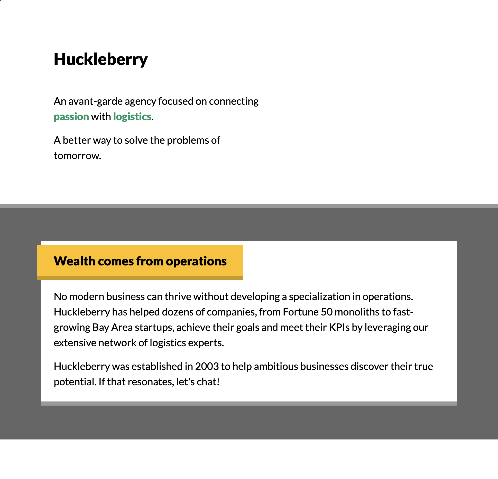

# CSS for JavaScript Developers - Huckleberry

This is a solution to the Josh W. Comeau's CSS for JavaScript Developers - Huckleberry workshop.

## Table of contents

- [Overview](#overview)
  - [Screenshot](#screenshot)
  - [Links](#links)
- [My process](#my-process)
  - [Built with](#built-with)
  - [What I learned](#what-i-learned)
  - [Continued development](#continued-development)
  - [Useful resources](#useful-resources)
- [Author](#author)
- [Acknowledgments](#acknowledgments)

## Overview

### Screenshot

### Links

- Solution URL: [Project: Huckleberry solution](https://github.com/jugglingdev/css-for-js-huckleberry)

## My process

### Built with

- HTML
- CSS float layout

### What I learned

In this challenge, I tackled solving the Huckleberry workshop with only float layout. That's right, no flexbox, grid, absolute positioning, `calc`, CSS variables, media queries or other advanced techniques. The purpose here was to get good at the basics: margin, padding, and border.

### Continued development

In the future, I'd like to build my discernment of when float layout works and when advanced techniques like flexbox and grid are needed. I just to flexbox pretty quickly, so it would be nice to simplify when that's not needed.

### Useful resources

- [CSS for JavaScript Developers](https://css-for-js.dev/) - Helpful little guide for getting the random computer choice.

## Author

- Kayla Paden - Find me at [GitHub](https://github.com/jugglingdev), [freeCodeCamp](https://www.freecodecamp.org/jugglingdev), [Frontend Mentor](https://www.frontendmentor.io/profile/jugglingdev), [LinkedIn](https://www.linkedin.com/in/kayla-marie-paden)

## Acknowledgments

Thank you to [Josh W. Comeau](https://css-for-js.dev/) for a great course that makes you get your hands dirty even when going back to basics.
